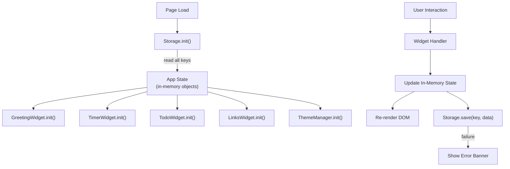

# Design Document: To-Do Life Dashboard

## Overview

The To-Do Life Dashboard is a purely client-side single-page application (SPA) built with HTML, CSS, and Vanilla JavaScript — no frameworks, no build toolchain, no backend. Everything runs in the browser and persists to `localStorage`.

The application is structured as four independent widgets arranged on one page:

- **Greeting Widget** — live clock, date, time-of-day greeting, and personalized name
- **Timer Widget** — Pomodoro-style countdown with named presets
- **Todo Widget** — full task CRUD (create, read, update, delete) with completion toggling
- **Links Widget** — bookmarkable quick-access link buttons

A global theme toggle (light/dark) and a single-file `localStorage` persistence layer round out the feature set.

### Design Principles

- **Zero dependencies** — pure HTML/CSS/JS, loadable from the file system
- **Separation of concerns** — each widget owns its DOM, state, and storage key
- **Progressive enhancement** — semantic HTML first; CSS and JS layer on top
- **Fail gracefully** — storage errors surface as visible user messages rather than silent failures

---

## Architecture

The application uses a **module-per-widget** approach within a single JavaScript file (`js/app.js`). There is no module bundler, so the file is organized into immediately-invoked namespaces / plain object modules separated by clear comment blocks.

```
index.html          ← single HTML file; semantic landmarks per widget
css/style.css       ← all styles; CSS custom properties for theming
js/app.js           ← all logic; one module per widget + storage + theme utilities
```

### High-Level Data Flow



### Tick Loop (Greeting Widget)

The greeting widget uses `setInterval` (1 000 ms) to update the clock and greeting text. Date change across midnight is detected by comparing the current `Date` day with the last-rendered day.

### Timer Countdown Loop

The timer uses `setInterval` (1 000 ms) when running. On each tick it decrements the remaining seconds, updates the display, and — when reaching zero — fires the completion handler (audio alert + notification text + button state reset).

---

## Components and Interfaces

### Storage Module

Centralizes all `localStorage` access. All other modules interact with storage only through this module.

```js
Storage = {
  KEYS: {
    tasks:   'tld_tasks',
    links:   'tld_links',
    presets: 'tld_presets',
    name:    'tld_name',
    theme:   'tld_theme',
  },

  // Returns parsed value or null; displays warning banner on parse failure
  read(key) → any | null,

  // JSON-serializes and writes; displays error banner on QuotaExceededError
  save(key, value) → boolean,
}
```

**Error handling contract:**
- `read()` catches `JSON.parse` errors → logs, displays warning banner, returns `null`
- `save()` catches `QuotaExceededError` and other `DOMException` → displays error banner, returns `false`

---

### GreetingWidget

```js
GreetingWidget = {
  init(storedName),       // mount DOM, start setInterval tick
  _tick(),                // update clock, date, greeting text
  _getGreeting(hour),     // pure function: hour → greeting string
  _setName(name),         // validate, save, update display
}
```

**Greeting logic** (pure mapping from hour → string):

| Hour range  | Greeting        |
|-------------|-----------------|
| 05 – 11     | Good Morning    |
| 12 – 17     | Good Afternoon  |
| 18 – 20     | Good Evening    |
| 21 – 23, 00 – 04 | Good Night |

---

### TimerWidget

```js
TimerWidget = {
  init(storedPresets),     // mount DOM, populate preset list, set default preset
  _startTimer(),
  _stopTimer(),
  _resetTimer(),
  _selectPreset(name),
  _addPreset(name, minutes),
  _deletePreset(name),
  _tick(),                 // called by interval; decrements remainingSeconds
  _formatTime(totalSeconds) → 'MM:SS',  // pure function
  _validatePreset(name, minutes) → ValidationResult,
  _onTimerComplete(),      // stop interval, play audio, show notification
}
```

State held in module scope:
```js
{
  presets: [{ name: string, minutes: number }],
  activePreset: { name, minutes },
  remainingSeconds: number,
  isRunning: boolean,
  intervalId: number | null,
}
```

---

### TodoWidget

```js
TodoWidget = {
  init(storedTasks),
  _addTask(title),
  _deleteTask(id),
  _toggleTask(id),
  _beginEdit(id),
  _confirmEdit(id, newTitle),
  _cancelEdit(id),
  _render(),               // full list re-render from state array
  _validateTitle(title) → boolean,
  _generateId() → string,  // timestamp + random suffix
}
```

State held in module scope:
```js
{
  tasks: [{ id, title, completed, createdAt }],
  editingId: string | null,
}
```

---

### LinksWidget

```js
LinksWidget = {
  init(storedLinks),
  _addLink(label, url),
  _deleteLink(id),
  _render(),
  _validateLink(label, url) → ValidationResult,
}
```

State held in module scope:
```js
{
  links: [{ id, label, url }],
}
```

---

### ThemeManager

```js
ThemeManager = {
  init(storedTheme),       // apply theme, update toggle UI
  _toggle(),
  _apply(theme),           // sets data-theme attribute on <html>
}
```

Theme is applied via a `data-theme` attribute on the root `<html>` element, with CSS custom properties switching via `[data-theme="dark"]` selector.

---

## Data Models

### Task

```js
{
  id:        string,   // e.g. "task_1718437200000_x3f"
  title:     string,   // 1–200 chars, trimmed
  completed: boolean,
  createdAt: string,   // ISO 8601 timestamp
}
```

### Preset

```js
{
  name:    string,  // 1–50 chars, unique within list
  minutes: number,  // integer, 1–180
}
```

### Link

```js
{
  id:    string,  // e.g. "link_1718437200000_y7k"
  label: string,  // 1–50 chars
  url:   string,  // http:// or https://, max 2048 chars
}
```

### Storage Schema

| Key           | Type                | Default value                              |
|---------------|---------------------|--------------------------------------------|
| `tld_tasks`   | `Task[]`            | `[]`                                       |
| `tld_links`   | `Link[]`            | `[]`                                       |
| `tld_presets` | `Preset[]`          | `[{ name: "Pomodoro", minutes: 25 }]`      |
| `tld_name`    | `string`            | `""`                                       |
| `tld_theme`   | `"light" \| "dark"` | `"light"`                                  |

All values are serialized as JSON strings via `JSON.stringify` / `JSON.parse`.

---

## Correctness Properties

*A property is a characteristic or behavior that should hold true across all valid executions of a system — essentially, a formal statement about what the system should do. Properties serve as the bridge between human-readable specifications and machine-verifiable correctness guarantees.*

### Property 1: Greeting hour coverage is exhaustive and non-overlapping

*For any* integer hour in [0, 23], `_getGreeting(hour)` SHALL return exactly one of the four greeting strings ("Good Morning", "Good Afternoon", "Good Evening", "Good Night"), and no hour SHALL be unmatched or matched by more than one branch.

**Validates: Requirements 1.3, 1.4, 1.5, 1.6**

---

### Property 2: Name greeting round-trip

*For any* non-empty, non-whitespace-only name string up to 50 characters, saving then restoring that name from Storage SHALL produce an identical trimmed string that appears in the greeting display as `"<Greeting>, <name>"`.

**Validates: Requirements 2.2, 2.3**

---

### Property 3: Whitespace-only name is rejected

*For any* string composed entirely of whitespace characters (including the empty string), submitting it as the user name SHALL remove any previously stored name and display the greeting without a name suffix.

**Validates: Requirements 2.4, 2.5**

---

### Property 4: Timer format correctness

*For any* integer number of seconds in [0, 10 800] (0 to 180 minutes), `_formatTime(seconds)` SHALL return a string matching the pattern `MM:SS` where MM ∈ [00, 180] and SS ∈ [00, 59].

**Validates: Requirements 3.1, 3.4**

---

### Property 5: Task addition round-trip

*For any* valid (non-empty, non-whitespace-only) task title up to 200 characters, adding it to the task list and then reading the task list from Storage SHALL produce a list that contains a task with the trimmed title.

**Validates: Requirements 5.2, 5.11**

---

### Property 6: Whitespace-only task title is rejected

*For any* string composed entirely of whitespace characters (including the empty string), submitting it as a task title SHALL result in no new task being added and the task list remaining unchanged.

**Validates: Requirements 5.3**

---

### Property 7: Task completion toggle is idempotent toggle

*For any* task in the list, toggling its completion status twice in succession SHALL restore the task's `completed` field to its original value.

**Validates: Requirements 5.5**

---

### Property 8: Task edit round-trip

*For any* task and any valid (non-empty, non-whitespace-only) new title, confirming an edit SHALL update the task's title to the trimmed new value; cancelling an edit SHALL leave the task's title exactly as it was before entering edit mode.

**Validates: Requirements 5.7, 5.8**

---

### Property 9: Preset list uniqueness invariant

*For any* sequence of add-preset operations, the preset list SHALL never contain two presets with the same name.

**Validates: Requirements 4.2, 4.3**

---

### Property 10: Preset count upper bound

*For any* sequence of add-preset operations, the preset list length SHALL never exceed 20.

**Validates: Requirements 4.2, 4.8**

---

### Property 11: Link URL protocol invariant

*For any* link stored in the link list, its `url` field SHALL begin with `http://` or `https://`.

**Validates: Requirements 6.1, 6.2, 6.3**

---

### Property 12: Link count upper bound

*For any* sequence of add-link operations, the link list length SHALL never exceed 20.

**Validates: Requirements 6.2, 6.4**

---

### Property 13: Theme toggle round-trip

*For any* starting theme value (`"light"` or `"dark"`), toggling the theme twice SHALL return the active theme to the original value.

**Validates: Requirements 7.3**

---

### Property 14: Storage round-trip preserves data integrity

*For any* valid in-memory state object (tasks array, links array, presets array, name string, theme string), serializing it to Storage and then deserializing it SHALL produce an object that is deep-equal to the original.

**Validates: Requirements 8.1, 8.2**

---

## Error Handling

| Scenario | Detection | Response |
|---|---|---|
| `localStorage.setItem` throws `QuotaExceededError` | Catch in `Storage.save()` | Display error banner: "Data could not be saved." |
| `JSON.parse` throws on read | Catch in `Storage.read()` | Discard value, initialize default, display warning: "Corrupted data was reset." |
| User submits empty / whitespace task | `_validateTitle()` returns false | Inline validation error below input |
| User submits duplicate preset name | `_validatePreset()` check | Inline error: "A preset with this name already exists" |
| User submits preset count ≥ 20 | Length check before save | Inline error: "Maximum of 20 presets reached" |
| User submits link count ≥ 20 | Length check before save | Inline error: "Maximum of 20 links reached" |
| User submits invalid URL protocol | `_validateLink()` regex check | Per-field inline validation error |
| Storage write fails when saving name | Catch in `Storage.save()` | User-visible error message per Requirement 2.6 |

All inline validation errors are associated with the corresponding form field (via `aria-describedby`) and cleared on the next valid submission or input change.

---

## Testing Strategy

### Unit Tests

Unit tests cover pure functions and isolated widget logic:

- `_getGreeting(hour)` — all 24 hour values, boundary edges (05, 12, 18, 21, 00)
- `_formatTime(seconds)` — 0, 1, 59, 60, 3599, 3600, 10800
- `Storage.read()` — valid JSON, invalid JSON (parse error), missing key
- `Storage.save()` — success path, `QuotaExceededError` path
- `_validateTitle(title)` — empty string, whitespace-only, valid title, 200-char boundary, 201-char over-limit
- `_validatePreset(name, minutes)` — duplicate name, out-of-range minutes, empty name, valid input
- `_validateLink(label, url)` — invalid protocol, too-long URL, valid input
- Theme toggle logic — light→dark→light cycle

### Property-Based Tests

PBT is appropriate for this feature: the widgets contain pure transformation functions, validation logic, and data round-trips whose correctness should hold over a large input space.

**Library**: [fast-check](https://github.com/dubzzz/fast-check) (JavaScript, runs in Node without a browser)

**Configuration**: Each property test runs a minimum of **100 iterations**.

**Tag format**: `// Feature: todo-life-dashboard, Property N: <property_text>`

| Property | fast-check Arbitraries | What's verified |
|---|---|---|
| P1 – Greeting coverage | `fc.integer({ min: 0, max: 23 })` | All hours return a valid greeting string |
| P2 – Name round-trip | `fc.string({ minLength: 1, maxLength: 50 }).filter(s => s.trim().length > 0)` | Save + restore produces identical trimmed name |
| P3 – Whitespace name rejected | `fc.stringOf(fc.constantFrom(' ', '\t', '\n', '\r'))` | List unchanged, no name suffix displayed |
| P4 – Timer format | `fc.integer({ min: 0, max: 10800 })` | Output matches `MM:SS` regex |
| P5 – Task addition round-trip | `fc.string({ minLength: 1, maxLength: 200 }).filter(s => s.trim().length > 0)` | Saved task title equals trimmed input |
| P6 – Whitespace task rejected | `fc.stringOf(fc.constantFrom(' ', '\t', '\n'))` | Task list unchanged |
| P7 – Toggle idempotence | `fc.boolean()` initial + `fc.array(...)` of tasks | Two toggles restore original completed state |
| P8 – Task edit round-trip | Valid title arbitrary | Confirm updates; cancel restores |
| P9 – Preset uniqueness | `fc.array(validPresetArb)` | No duplicate names in list after any sequence of adds |
| P10 – Preset count bound | `fc.array(validPresetArb, { maxLength: 30 })` | List never exceeds 20 |
| P11 – URL protocol invariant | `fc.array(validLinkArb)` | All URLs start with `http://` or `https://` |
| P12 – Link count bound | `fc.array(validLinkArb, { maxLength: 30 })` | List never exceeds 20 |
| P13 – Theme toggle round-trip | `fc.constantFrom('light', 'dark')` | Two toggles return to original theme |
| P14 – Storage round-trip | `fc.record({ tasks, links, presets, name, theme })` | `parse(stringify(x))` deep-equals `x` |

### Integration / Smoke Tests

- Manual smoke test: open `index.html` in Chrome, Firefox, Edge, Safari; verify no console errors
- LocalStorage persistence: reload page and confirm all data is restored
- Timer audio: verify the `AudioContext` beep fires on timeout in a browser context
- Accessibility: run axe-core against rendered page for WCAG 2.1 AA violations

### Accessibility Testing Notes

Full WCAG validation requires manual testing with screen readers (NVDA, VoiceOver) and keyboard-only navigation. Automated checks (axe-core, Lighthouse) cover a subset of criteria.
